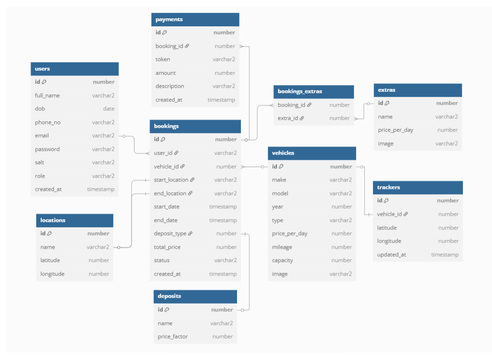

# EcoFriendlyRentals

### About

EcoFriendlyRentals is an **Oracle APEX-based** car rental application focused on sustainability. 

The booking interface allows users to:
- Set **rental locations and dates** 
- Browse **available vehicles**
- Enhance rental customization with **supplementary services**

The platform incorporates:
- **Security** measures for user authentication, authorization, and payments
- **Reporting** tools for administrators: data aggregation and analytics
- Integrated **mapping** service (**OpenChargeMap API**) to locate nearby charging infrastructure

### Database Schema

  

### Installation Guide

1. **Clone the Repository**  

2. **Log in to Oracle APEX**  
   - Ensure you have workspace administration rights.

3. **Import the Application**  
   - Navigate to **App Builder**.
   - Click on **Import**.
   - Select the `eco-friendly-rentals.sql` file from the repository.
   - Ensure that the option to include **supporting objects** is checked.
   - Follow the on-screen instructions to complete the import process.

